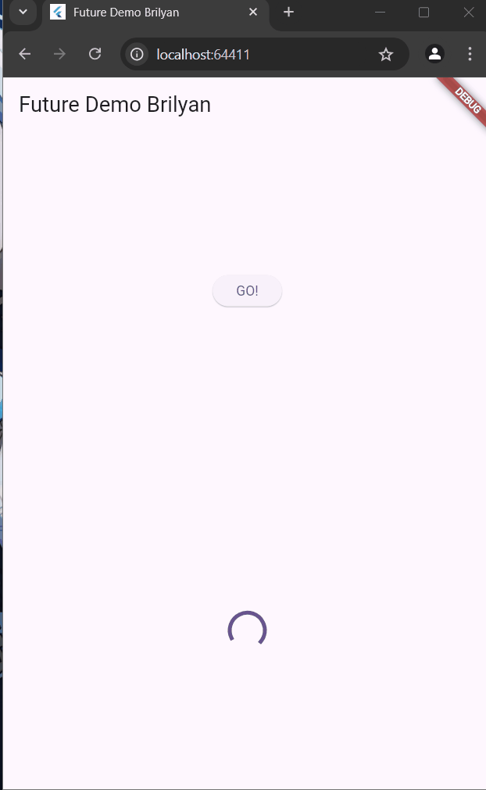
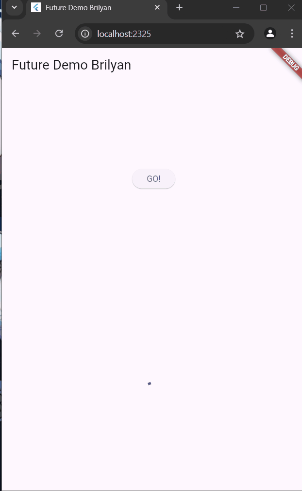
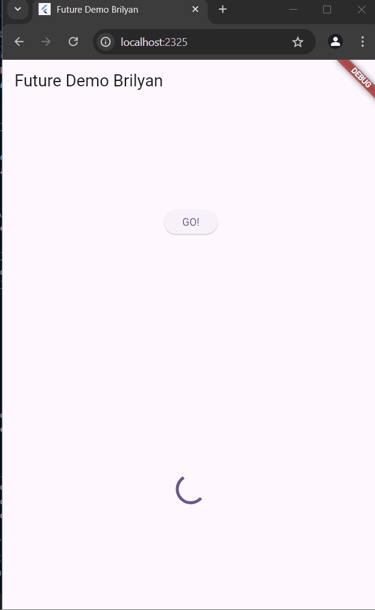
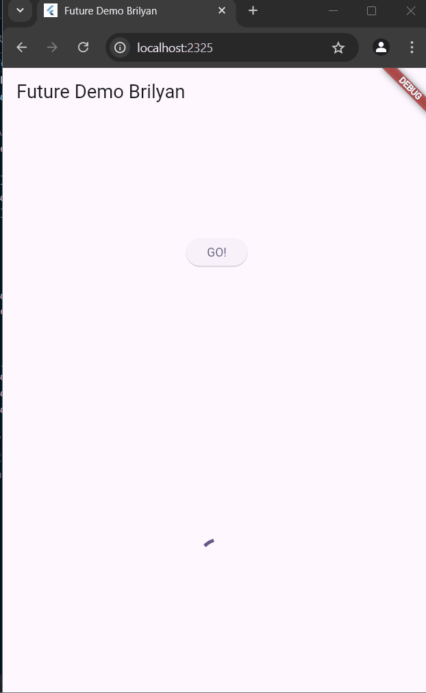
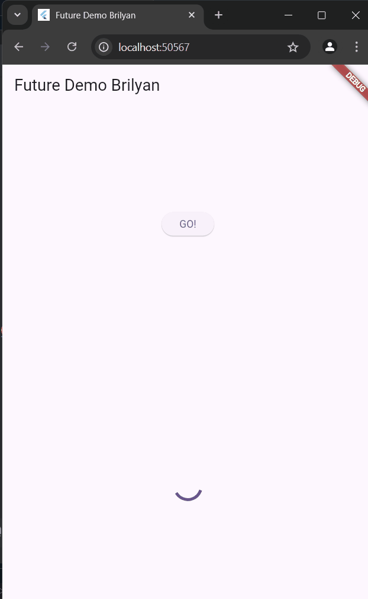
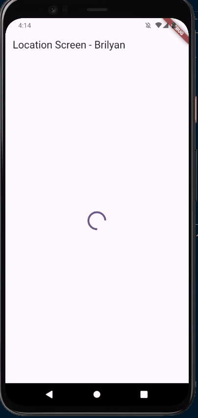
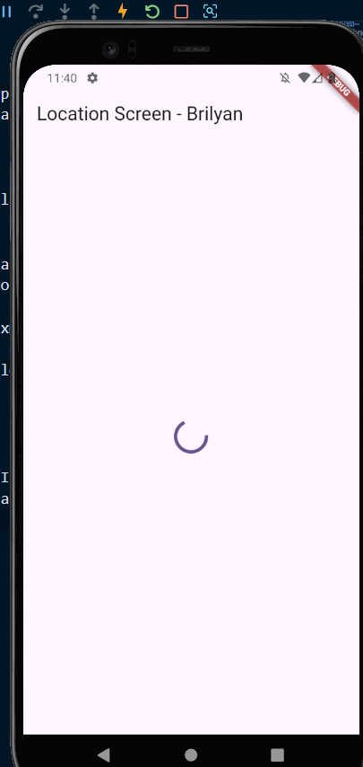
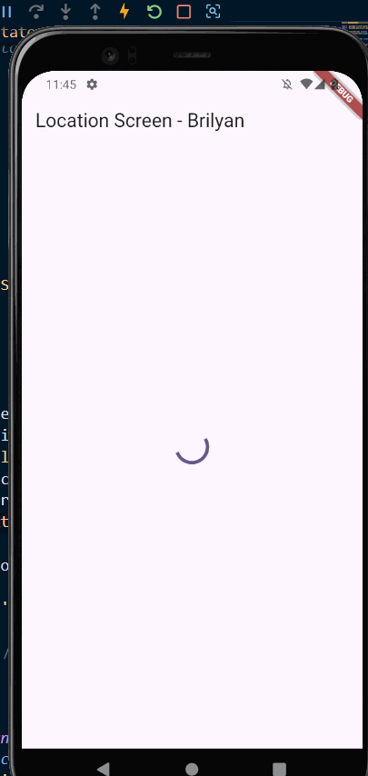

# Async Programming
## Brilyan Satria Wahyuda
## TI-3H/2241720019
### Soal 3

Soal 3:   

- substring: digunakan untuk ekstraksi sebagian isi string, memiliki 2 parameter yaitu start dan end. Sehingga hanya akan mengambil string dari 0 sampai 450, dengan kata lain 450 character pertama dalam string
  
- catchError digunakan untuk menghandle error di operasi asnyc, pada konteks ini catchError akan menangkap error apa yang terjadi saat kiya mengambil string tadi, jika ada error maka akan ditampilkan result yang telah kita tentukan
  
Berikut adalah hasil run soal 3 dengan menggunakan Google books API 

### Soal 4

Maksud dari langkah 1 adalah membuat sebuah function yang bersifat asnyc dimana function akan di delay selama 3 detik sebelum berjalan. Saat berjalan function akan mereturn bilangan yang telah ditentukan

Maksud dari langkah 2 adalah menangkap value return dari tiga function async yang telah dibuat, setelah ditangkap dan dijumlahkan dalam variable total, akan diteruskan ke variabvle result yang nantinya akan ditampilkan ke layar.

Berikut adalah hasil run soal 4 dengan memanfaatkan async function:

### Soal 5

Maksud dari langkah 2 adalah:  
- Pembuatan Completer dengan variable late yang berarti variable ini bisa diisi nanti 
    - Pembuatan function get number, dimana function ini akan menjalankan sebuah asnyc operation calculate()
    - PAda function calculate() akan terjadi delay selama 5 detik, setelah itu akan return sebuah value bernilai 42
    Berikut adalah hasil run soal 5 yang menggunakan completer
  
  

### Soal 6

Perbedaan paling besar ada di fungsi calculate, sekarang terdapat catch dan akan dieksekusi completer.completeError yang menyelesaikan future dengan error.   Dalam Elevated Button juga terdapat try catch yang akan menampilkan pesan error saat terjadi.  Untuk hasil run, saya mendapat hasil yang sama seperti praktikum sebelumnya yaitu menampilkan angka 42: 

 

### Soal 7

Akan dijalankan Future Group dengan delay 3 detik, tidak seperti future biasa yang saling tunggu, Future Group akan menjalankan secara bersamaan sehingga hasilnya lebih cepat.

 

 ### Soal 8
 
Perbedaan paling mencolok adalah, saat menggunakan variabel final futures akan terlihat lebih simpel untuk dibaca, namun FutureGroup memberikan kita kontrol yang lebih untuk fungsi kita, bisa digunakan untuk skenario kompleks dimana kita perlu mengatur fungsi secara detail. Untuk menggunakan beberapa future sederhana, bisa disimpan di sebuah variabel saja seperti final futures

 ### Soal 9
 
 
Berikut adalah hasil run soal nomor 9 

 

 ### Soal 10
 
Terdapat sebuah perbedaan yakni digunakan try catch, saat error didapatkan(catch) error msg akan diparse ke string dan ditampilkan di layar, lalu ada finally yaitu setelah error catching berhasil ia akan dijalankan.

 ### Soal 11
 
Sudah saya tambahkan nama panggilan pada appbar Location Screen

 ### Soal 12 
 
Saat di run di browser, tidak akan tampil apapun. Bahkan tidak ada permintaan akses permission untuk lokasi device, hal ini karena browser tidak memiliki akses lokasi seperti halnya emulator atau device yang telah kita atur di AndroidManifest.xml

 
Berikut adalah hasil run soal 12 dengan menambahkan delay loading selama 3 detik sebelum menampilkan lokasi 

  

### Soal 13

Saat di run tidak ada perbedaan UI yang ditampilkan, karena kita hanya mengubah proses building nya tanpa merubah UI

### Soal 14

Perbedaan UI hanya terdapat pada hasil akhir, jika terdapat error maka akan menampilkan pesan 'Something terrible happened!'

